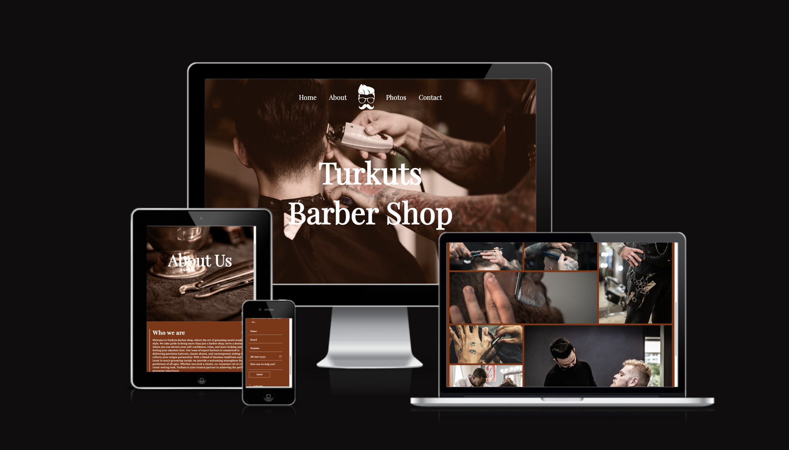
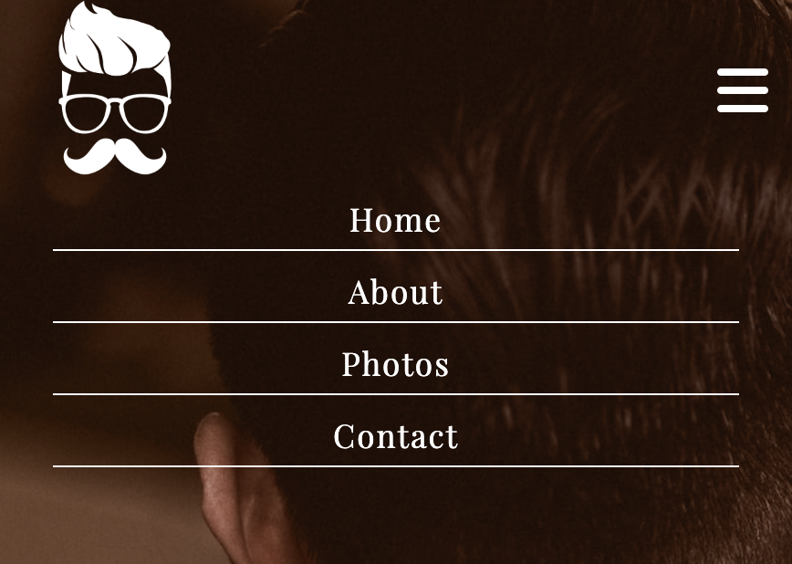
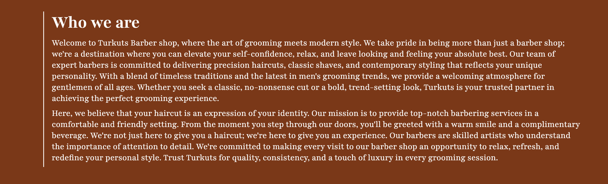
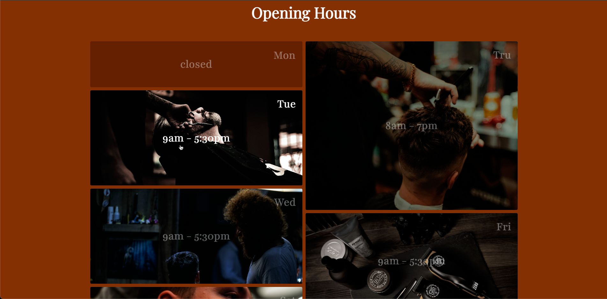
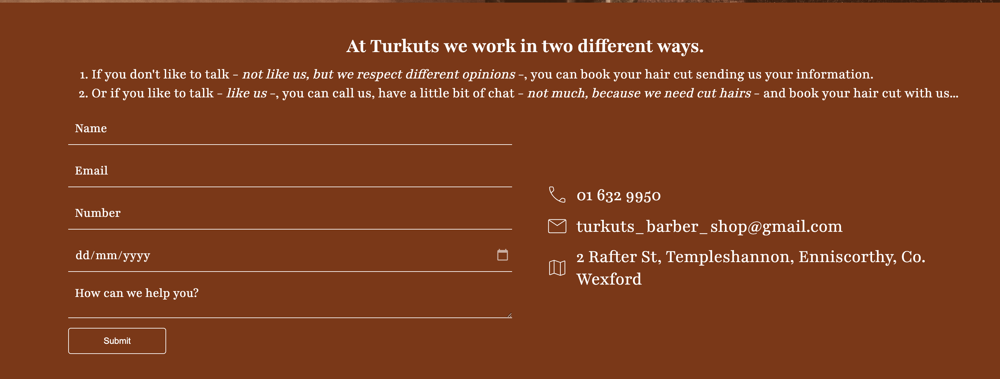
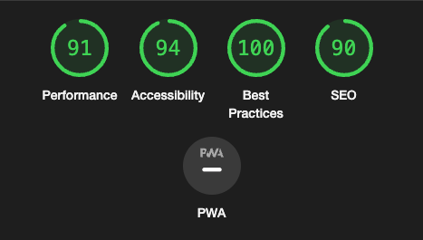

# Turkuts Barber Shop

<!-- Introduction starts -->

Welcome to Turkuts Barber Shop, your premier destination for top-quality grooming and styling services. Our website is designed to provide you with a glimpse of the exceptional services we offer, introduce you to our skilled team, and facilitate easy communication. Whether you're looking for a classic haircut, grooming, or styling, Turkuts Barber Shop has you covered.

<!-- Introduction ends -->

<!-- Screenshot of Responsive -->

<!-- Current & New User Goals starts -->

# Current & New User Goals

The following features on the [Turkuts Barber Shop](https://williampgdias.github.io/turkuts_barber_shop/) website are designed to cater to the needs of both first-time visitors and returning users. Each feature contributes to the overall experience, making the site appealing and functional for various user goals:

### Navigation Bar

The full responsive navigation bar is a cornerstone feature, ensuring effortless movement across the site for all users. Whether it's discovering our services, viewing the gallery, or signing up, the navigation bar facilitates smooth and intuitive browsing.

### Landing Page Image

The landing page image acts as the first visual encounter, making a striking impression and providing a quick insight into Turkuts Barber Shop's ambiance and offerings. It's a key element for users to relate to the atmosphere of the barbershop.

### Booking Information

The Booking Information section centralizes details regarding the booking process, availability, and how to schedule an appointment, offering a seamless and clear pathway for clients to reserve their preferred time slots.

### Meetup Times

The Meetup Times section displays the operating hours, providing crucial information for clients who plan to visit the barbershop, ensuring clarity for their appointments or walk-in schedules.

### Footer Information

The footer section, equipped with links to relevant social media sites, serves as a means for users to stay connected and updated on the latest news, events, and promotions.

These features collectively cater to the varied needs of our visitors, offering a user-friendly experience and meeting the goals of both new and returning users, contributing to the essence and functionality of Turkuts Barber Shop.

<!-- Current & New User Goals end -->

<!-- Existing Features starts -->

## Existing Features

- Responsive Navigation Bar
  - **Consistent Navigation:** The navigation bar maintains a consistent appearance across all pages of the website, ensuring that users can easily find their way around without any confusion.
  - **User-Friendly Design:** The responsive design of the navigation bar means it adapts seamlessly to different devices, making it accessible and user-friendly on both desktop and mobile screens.
  - **Effortless Page Switching:** Users can effortlessly switch between pages without the need to use the browser's "back" button. This feature provides a smooth and efficient browsing experience.
  - **Quick Access to Key Sections:** The navigation bar includes links to essential sections of the website, such as the Home page, Gallery, and About page, enabling visitors to access these areas directly from any page.

This feature enhances the overall usability of the website, ensuring that visitors can easily explore the content and find the information they need without hassle.

- Landing Page

  - Our landing page prominently features a captivating image with overlaid text, designed to introduce visitors to Turkuts Barber Shop and create a compelling first impression. This image serves several key purposes:
    - **Introduction to Turkuts Barber Shop:** The landing page image is more than just a visual element; it's a powerful introduction to the essence of Turkuts Barber Shop. The combination of imagery and text is strategically crafted to capture the user's attention and convey the essence of our services.
    - **Eye-Catching Animation:** An eye-catching animation further enhances the visual impact of this section, encouraging users to explore our website and discover the quality services we offer.

This feature makes a strong first impression and sets the stage for users to explore our website further, ultimately leading to greater engagement and understanding of what Turkuts Barber Shop is all about.

- About page

  - Our Commitment
    - At Turkuts Barber Shop, we're dedicated to providing top-notch grooming and styling services tailored to your unique preferences. Our skilled barbers are committed to helping you look and feel your best. Here's what sets us apart:
    - **Expert Barbers:** Our team of experienced and friendly barbers are passionate about their craft, ensuring that you receive quality services every time you visit.
    - **Personalized Styling:** We understand that your style is unique. Whether you're looking for a classic haircut, grooming, or styling, we tailor our services to meet your specific needs.
    - **Quality Products:** We use premium grooming products to deliver outstanding results. Your satisfaction and comfort are our top priorities.
    - **Your Trusted Barber Shop:** Turkuts Barber Shop is more than just a place for a haircut; it's your destination for personal grooming and style enhancement.

Discover the difference at Turkuts Barber Shop, where your style and satisfaction are our primary focus.

- Opening Hours

  - Users can find the current opening hours and operating days on our website.
    - Our goal is to make our services accessible to the user at their convenience. Whether the users are looking for a fresh haircut, grooming, or styling, Turkuts Barber Shop is committed to serving when it suits best.

Visit our About Page for the most up-to-date information on our opening hours and any special announcements related to our operating times.

- Footer

  - We have comprehensive information about our barber shop, including links to relevant social media platforms and contact number.

Our footer section serves as a gateway to connect with Turkuts Barber Shop and stay updated with our latest news, promotions, and events. By visiting the About Page, you can access all the necessary information to engage with us through social media platforms, ensuring you don't miss any updates or special offers.

- Gallery
  - The gallery in the Photos page will provide the user with supporting images to see how Turkuts Team works and the final job.
  - This section is valuable to the user to have some ideas about how they want their hair cut, grooming, etc.

- Contact Page
  - This page allow the user to get in touch with Turkuts team and make an appointment to enjoy their services. The user will be asked to submit their name, phone number, email address and some message.
  - This page also have the number, email address with direct links and location of the Shop.

<!-- Existing Features ends -->

<!-- Testing Starts -->

<!-- Manual Testing starts -->

## Testing

Testing for the website involved an extensive range of user interactions, ensuring a seamless and user-friendly experience. The following user interactions were thoroughly documented and tested:

### Navigation Links

- **Main Navigation Links:** Verified functionality by clicking on navigation links (Home, About, Photos and Contact) across all pages to ensure smooth transitions and accurate page redirection.

### External Links

- **Footer Social Media Links:** Checked functionality by clicking on social media icons in the footer to ensure they open in new tabs and direct to the correct social media links.

### Site Responsiveness

- **Responsive Design Testing:** Verified the website's responsiveness on various devices and screen sizes (desktop, mobile, tablet) to guarantee a visually appealing and functional display.

### Contact Form

- **Contact Form Submission:** Tested the contact form functionality by submitting both complete and empty forms to ensure error handling and submission success.

### Booking System

- **Appointment Booking Process:** Assessed the appointment booking system, including selecting preferred time slots and verifying successful bookings.

These tests ensure that every aspect of user interaction on the site has been thoroughly examined, providing a smooth and error-free experience for visitors to Turkuts Barber Shop.

<!-- Manual Testing ends -->

### Validator Testing

- **HTML:** No errors were returned when padding through the official W3C validator.

  - Results:
    - [Home page](https://validator.w3.org/nu/?doc=https%3A%2F%2Fwilliampgdias.github.io%2Fturkuts_barber_shop%2F#textarea)
    - [About page](https://validator.w3.org/nu/?doc=https%3A%2F%2Fwilliampgdias.github.io%2Fturkuts_barber_shop%2F#textarea)
    - [Photos page](https://validator.w3.org/nu/?doc=https%3A%2F%2Fwilliampgdias.github.io%2Fturkuts_barber_shop%2F#textarea)
    - [Contact page](https://validator.w3.org/nu/?doc=https%3A%2F%2Fwilliampgdias.github.io%2Fturkuts_barber_shop%2F#textarea)

- **CSS:** No errors were found when passing through the official (Jigsaw) validator.

  - [Result](https://jigsaw.w3.org/css-validator/validator?uri=https%3A%2F%2Fwilliampgdias.github.io%2Fturkuts_barber_shop%2F&profile=css3svg&usermedium=all&warning=1&vextwarning=&lang=en)

- **Access Scan:** The website was checked for accessibility on [Access Scan](https://accessibe.com/accessscan).

  - [Result](https://accessibe.com/accessscan?website=https://williampgdias.github.io/turkuts_barber_shop/&gclid=Cj0KCQjwhfipBhCqARIsAH9msbmH0ZoNUgpQOevkFdqeJXGf1oWnW01JzXCs8vsEIrWnDX4pjfYfU5AaAhpWEALw_wcB)
  - All the pages was checked by the Access Scan.

- Accessibility
  - I confirmed that the colors and fonts chosen are easy to read and accessible by running it through lighthouse;
  - Every page was checked by Lighthouse

### Unfixed Bugs

- No known bugs or issues have been left unfixed. Turkuts Barber Shop strives to provide a seamless and error-free experience for its visitors.

### Browsers and Screen Sizes

The website has been tested on various browsers and screen sizes to ensure compatibility. It is designed to provide an optimal experience on different devices, from desktop to mobile.

## Known Issues

No known issues or bugs remain unfixed at this time. The website is regularly maintained to address any potential problems and to ensure that it functions as intended.

Thank you for visiting Turkuts Barber Shop's website. If you have any feedback or encounter any issues, please don't hesitate to reach out to us.

<!-- Testing ends -->

<!-- Deployment starts -->

## Deployment

### Step 1: Create a Repository

1. **Login to GitHub:** Visit [GitHub](https://github.com) and log in to the account.
2. **Create a New Repository:**
   - Click on the '+' icon in the top right corner of your GitHub profile.
   - Select "New repository."
3. **Repository Configuration:**
   - Name the repository.
   - Ensure the repository is public.
   - Click the "Create repository" button to finalize.

### Step 2: Upload the Files

4. **Upload The Website Files:**
   - On the newly created repository page, add your website files (HTML, CSS, images, etc.) into the repository by clicking in Upload or Drag the folder into the page.

### Step 3: Enable GitHub Pages

5. **Access Repository Settings:**
   - Inside the repository, go to the "Settings" tab.
6. **GitHub Pages Section:**
   - Scroll down to the GitHub Pages section.
   - Under "Source," select the branch containing your website files.
   - Save the changes.
7. **Confirmation:**
   - GitHub will display the URL where your site is published.
8. **Wait for Deployment:**
   - GitHub Pages might take a few minutes to deploy the site. Once deployed, the website will be live at the provided URL.

### Step 4: Access Your Published Site

9. **Visit The Published Site:**
   - Access the website using the provided URL.
   - Ensure the content displays correctly.

This process will enable to publish and maintain the website using GitHub Pages.
 
The live link can be found here: https://williampgdias.github.io/turkuts_barber_shop/

<!-- Deployment ends -->

<!-- How to edit the repository starts -->

### Making Changes on the Project

Whenever changes are made to the project, the developer commits these changes with a descriptive message. This helps other developers understand the project's development progress and assists the developer in keeping track of project changes.

The following steps are followed to manage project changes:

1. **Git add .:** Updates made to the project are included using this command. It stages the changes for the next commit.

2. **Git commit -m "Your commit message here":** After staging the changes, this command is used to capture a snapshot of the project's currently staged changes with a descriptive commit message.

3. **Git push:** This command is used to upload the local repository content to a remote repository. It transfers commits from the local repository to a remote repository, allowing for collaboration and version control.

These steps ensure that the project is regularly updated and documented to facilitate seamless collaboration and development.

<!-- How to edit the repository ends -->

<!-- Credits starts -->

## Credits

In the development of Turkuts Barber Shop, we acknowledge and provide credit to the following sources for their valuable contributions:

### Content

- Instructions on how to implement form validation on the Contact page were guided by a specific Tutorial on Google.
- Icons used through the website were sourced from [Font Awesome](https://fontawesome.com/).

### Media

- The photos utilized on the every page are obtained from [Unsplash - Free Images](https://unsplash.com).
- Images featured on the Gallery page were gathered from [Pexels](https://www.pexels.com/).

We express our gratitude to these sources for their contributions to our project.

The code for this project can be found in the repository: [Turkuts Barber Shop Repository](https://github.com/williampgdias/turkuts_barber_shop).

<!-- Credits ends -->
